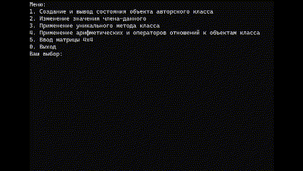
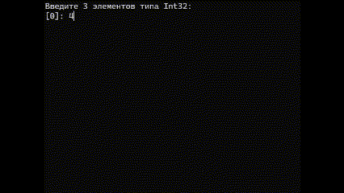

# 📘 Learning C#

**This repository contains materials from a short C# course.**  
It clearly demonstrates working with OOP, specifically classes, generics, inheritance, file handling, and more.

---

## 📂 Project Structure

```
/l1/  # C# basics and switch-case
/l2/  # Working with strings and string manipulation
/l3/  # Creating structs and working with files
/l4/  # Working with classes
/l5/  # Inheritance, base and derived classes
/l6/  # Generic classes
/l7/  # Classes, generics, and arrays
```

> Each folder contains a task description, source code, and a sample run.

---

## ⚙️ Technologies

- Language: **C# .NET 7.0**
- IDE: **Visual Studio**
- Operating System: **Windows**

---

## 🚀 How to Run

1. Clone the repository:

```bash
git clone https://github.com/dmitrykaras/LearningCs
```

2. Navigate to the desired lab folder:

```bash
cd path_to_folder
```

3. Build and run using the .NET CLI:

```bash
dotnet build
dotnet run
```

> Or open the project in Visual Studio

---

## 📚 Topics Covered

- Basics of C# syntax
- Control flow (if, switch, loops)
- Functions and recursion
- Arrays and collections
- Classes and object-oriented programming
- File I/O operations
- Generics and operator overloading
- Exceptions and error handling
- Working with memory and references

---

## 🧠 Project Purpose

This project serves as a learning archive of my hands-on experience with C#.  
It may also be useful to other students as a reference and code example.

---

## 🖼️ Screenshots

  
  

---

## 📄 License

Feel free to use the materials from this repository — the project is licensed under the [MIT License](LICENSE).
